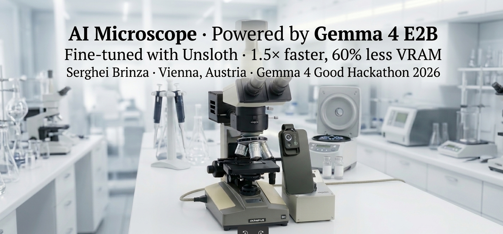
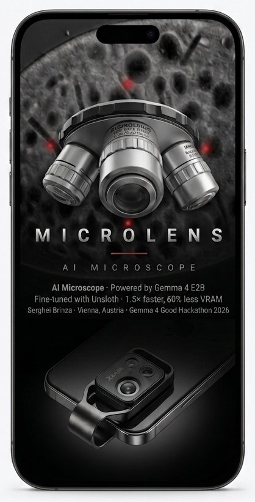
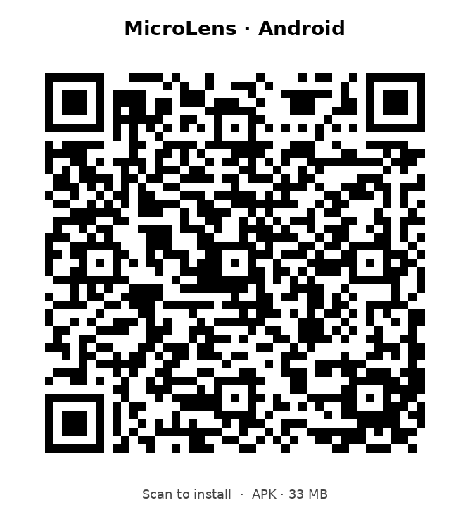

# MICROLENS

### 🎬 [Watch the 90-second demo on YouTube](https://youtu.be/r1GIi4EukVg)

*Base Gemma 4 vs MicroLens on real diatom and fungal-spore specimens.*

---

## What is MicroLens

MicroLens is a fine-tuned vision-language model that identifies microscopic specimens — diatoms and fungal spores — across 95 genera, packaged as an Android APK, a Linux desktop app, and a HuggingFace Space. It runs fully offline on consumer hardware via a 3.0 GB Q4_K_M GGUF and was trained on 75,491 vision-question-answer pairs (67,121 train + 8,370 validation) drawn from three open-licensed source datasets — all CC-BY 4.0 or CC0 for unambiguous commercial-use compatibility.

## Why

- **Health & Sciences:** accelerates specimen triage in low-resource clinics and field labs.
- **Digital Equity:** fully offline. Works in jungles, polar stations, refugee camps. No API key, no cloud bill, no connectivity required.
- **Future of Education:** turns a low-cost USB microscope into an interactive biology tutor for classrooms and field-biology courses.

## Hackathon prizes targeted

- Health & Sciences track
- Digital Equity track
- Future of Education track
- Unsloth $10K Special Prize, built end to end with Unsloth FastVisionModel and 4-bit QLoRA
- Ollama Special Mention, ships with a working Modelfile for local on-device deployment

## Quick start

**HuggingFace Space, no install:**

[huggingface.co/spaces/Laborator/microlens](https://huggingface.co/spaces/Laborator/microlens)

> The fine-tuned MicroLens Final weights are being rebuilt against the license-clean dataset described in [docs/DATA_CARD.md](docs/DATA_CARD.md). Until those weights ship, the demo and the bundled `Modelfile` reference the **base** `unsloth/gemma-4-E2B-it` so the user-facing flow remains runnable end to end. The fine-tuned weights will land on the same HuggingFace Hub and Ollama tags when the Final training run completes.

### Android install

Scan the QR code below with your phone camera, or download the APK from Releases manually.

<table align="center"><tr>
<td align="center"></td>
<td align="center"></td>
</tr></table>

### Why Android shows a security warning

When you install MicroLens APK from GitHub Releases, Android will show a warning like "This file is from an unknown source" or "Install blocked". This is the standard Android security behavior for any app not distributed through Google Play Store.

The warning is normal and unavoidable for direct APK installs. It does not mean the app is malicious.

To install:

1. Tap "Install anyway" or "Allow from this source"
2. If asked, grant your browser or file manager permission to install apps
3. Open the downloaded APK and tap Install

The APK is signed and built from this open-source repository. You can verify the binary by building it yourself from the android/ source tree, or by checking the SHA-256 hash on the Releases page: https://github.com/SergheiBrinza/microlens/releases

For a no-install experience, use the HuggingFace Space instead: https://huggingface.co/spaces/Laborator/microlens

### Native apps

<table>
<tr>
<td align="center" width="20%">
 
<b>Android</b> 
Available now 
<a href="https://github.com/SergheiBrinza/microlens/releases">Download APK</a>
</td>
<td align="center" width="20%">
 
<b>Linux</b> 
Available now 
<a href="https://github.com/SergheiBrinza/microlens/releases">Download</a>
</td>
<td align="center" width="20%">
 
<b>iOS</b> 
In development 
<a href="https://huggingface.co/spaces/Laborator/microlens">Try web demo</a>
</td>
<td align="center" width="20%">
 
<b>macOS</b> 
In development 
<a href="https://huggingface.co/spaces/Laborator/microlens">Try web demo</a>
</td>
<td align="center" width="20%">
 
<b>Windows</b> 
In development 
<a href="https://huggingface.co/spaces/Laborator/microlens">Try web demo</a>
</td>
</tr>
</table>

### Don't have Android or Linux? No problem.

While native apps for iOS, macOS, and Windows are in development, you can use MicroLens right now in your browser through HuggingFace Space, with the same model and full functionality:

 
<b><a href="https://huggingface.co/spaces/Laborator/microlens">Open MicroLens on HuggingFace Space →</a></b>

### Or run locally via Ollama

The repository ships a [Modelfile](Modelfile) that pins the prompt template and SYSTEM disclaimer. Build a local Ollama image once the fine-tuned GGUF weights are downloaded into `gguf/`:

 
<code>ollama create microlens -f Modelfile && ollama run microlens</code>

## Links

- GitHub: https://github.com/SergheiBrinza/microlens
- Model: https://huggingface.co/Laborator/microlens-final
- HF Space: https://huggingface.co/spaces/Laborator/microlens
- Kaggle dataset (VQA): https://www.kaggle.com/datasets/sergheibrinza/microlens-vqa-hackathon
- Kaggle dataset (Images): https://www.kaggle.com/datasets/sergheibrinza/microlens-images-hackathon
- Kaggle dataset (LoRA): https://www.kaggle.com/datasets/sergheibrinza/microlens-lora-final
- Ollama (on-device, 3 GB GGUF): https://ollama.com/brinzaengineeringai/microlens-final
- Kaggle notebook: https://www.kaggle.com/code/sergheibrinza/microlens-final
- APK releases: https://github.com/SergheiBrinza/microlens/releases
- Governance: [docs/DATA_GOVERNANCE.md](docs/DATA_GOVERNANCE.md)

## At a glance

| | |
|---|---|
| Base model | unsloth/gemma-4-E2B-it, 4.44B params, multimodal |
| Method | Unsloth FastVisionModel + 4-bit QLoRA (r=16, alpha=32, dropout=0) |
| Trainable params | 29.9M (0.58% of base) |
| Training data | 75,491 VQA pairs across 3 license-clean source datasets, 2 categories, 95 genera |
| Categories | diatom (62,933 train), fungal_spore (4,188 train) |
| Source datasets | UDE Diatoms (CC0) · DIATLAS (CC-BY 4.0) · TgFC (CC-BY 4.0) |
| Hardware | 1 × RTX 3090 Ti, 24 GB VRAM |
| Training time | 2 epochs, ~14 h wall-clock, single GPU |
| Energy | ≈ 4 kWh, ≈ 0.4 kg CO2-equivalent on the Austrian grid |
| Artifacts | LoRA, merged FP16, GGUF Q4_K_M, mmproj |
| Deployment | Android APK, Linux desktop, HuggingFace Space, Ollama |

---

> **Disclaimer.** MicroLens is decision support for education and citizen science. Not a medical device, not a diagnostic tool, not a regulated product. Verify with a domain specialist before any consequential decision. See [docs/DATA_GOVERNANCE.md](docs/DATA_GOVERNANCE.md) for the full release framework.

Made by **Serghei Brinza**, Vienna, Austria, Apache 2.0 (code + weights), CC-BY 4.0 (writeup)

